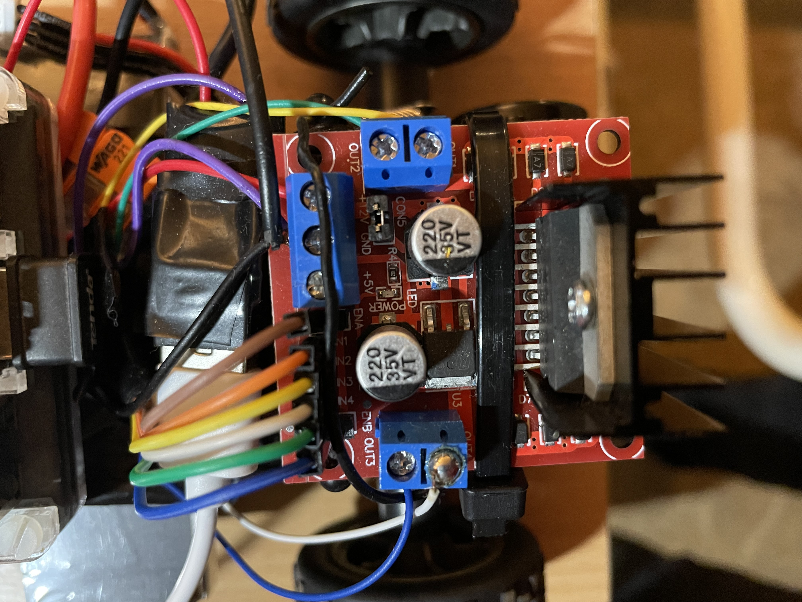

# KidCodersRC

This project provides a web interface and a web API (on WLAN) to control a remote-controlled car using GPIO pins on a Raspberry Pi. It includes a simple wrapper for movement commands, enabling kids to control the car while learning programming basics. It also integrates with Large Language Models (LLMs) to interpret user commands and convert them into car movements.

## Features

- Control the car directly using pre-defined movement buttons.
- Let your kid see their code running literally.
- Send textual commands to the car using an input box.
- Integration with Mistral AI or Ollama locally for LLM-driven commands.

[](https://www.youtube.com/watch?v=reW0mn_GdWY)

## The used hardware

- A cheap radio-controlled electric car with steering and drive motor.
- A battery (LiPo 1600mAh 7.4V 30-60C)
- A Raspberry Pi 2b + wifi dongle (any raspi with wifi)
- L298N H-Bridge to drive the motors
- A 3A USB (STDWN-USB3-5V) for more wattage (the L298N has a 5V out, but not enough power. At least when the camera modul was also on the raspi)

## Hardware assembly
Well it was a year ago, when I wired up this thing the first time. Since then it's the 3rd donor car that is why the 6V and time limit is in the code now.
What is important:
- First handle your raspberry: install the OS, set the wifi, and set to boot up in CLI and copy this repo to your home directory
- Assign a static IP for your raspi on your router and from now on you can handle anything from your computer (or do the nerd part now)

- If you disassemble a car you will see on the original board 7 wires connecting. Two from the battery (the positive from the switch), two from the steering, two from the drive and one for the antenna. Easy.
- Don't forget to wire the battery positive through the car's original switch
- Common every grounding

- To wire your L298N with the raspi will require more attention. Check the images and documents for L298N.
  There are three blue terminals. One with three connections and two with two connections.<br>
  The one with 3 connectors:<br>
	The middle is the negative for the battery, the usb and the raspberry GPIO negative.<br>
	The positive for the usb and the battery (from the switch) is the connector closer to the other blue terminal.<br>
  The one which is closer to the 3 connectored terminal is the steering (motor A)<br>
  The other is the drive (motor B)<br>
  My terminal for motor B was wrong, that is why you see it is connected on the top.<br>
  To figure out which one drives the motor in one way or an other is just luck. (The brighter color should be the positive and connected closer to the cooler, but who knows how the car factory planned it.) You may swap the cables later or modify the directions in the code.<br>
  For the control cables check the images and match the colors.
  
  



## Raspberry setup
Steps on your raspi:
If you didn't copy the repo to your home dir, copy it with WinSCP then use Putty for the following part (tha address is the fix IP you gave on the router, the user and pass is your user/pass for the raspi). If you use linux, you know what to do.
If you wish to use Mistral AI first add your environment variable with your Mistral API key:
```
sudo nano /etc/environment
```

add:

```
MISTRAL_API_KEY=****************************
```

Then make the code start automatically, when you switch on the car:
```
sudo crontab -e
```

add:

```
@reboot MISTRAL_API_KEY=$MISTRAL_API_KEY python3 /home/[YOUR_USER]/car.py
```

If you don't use Mistral or any LLM, just simply add:
```
@reboot python3 /home/[YOUR_USER]/car.py
```

## Ollama setup (optional)
If you wish to use LLM locally on your own computer, download ollama. Then in the terminal run "ollama run [model]" e.g. 'llama3.2'. and it will download it. Later it will run as a service so you don't have to do anything. Please be aware that Ollama needs the OLLAMA_HOST environment variable to set to 0.0.0.0 on your computer to be able to receive requests from outside your computer. Also check the firewall if you have trouble.

## Setup your kid's computer
If you do python and want to teach your kid:

- copy the for_your_kid/EN directory on your kid's computer (or /HU )
- set the ip of the car (the *.ip file)
- open toy_car.py and your kid is ready to use it


Enjoy!
